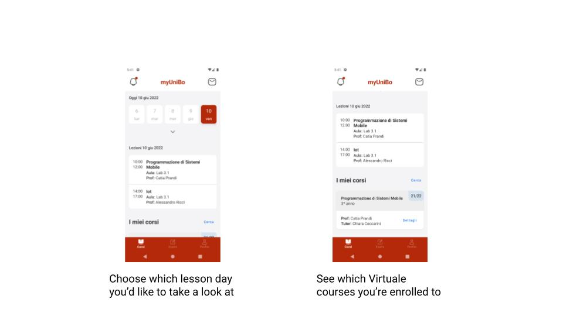
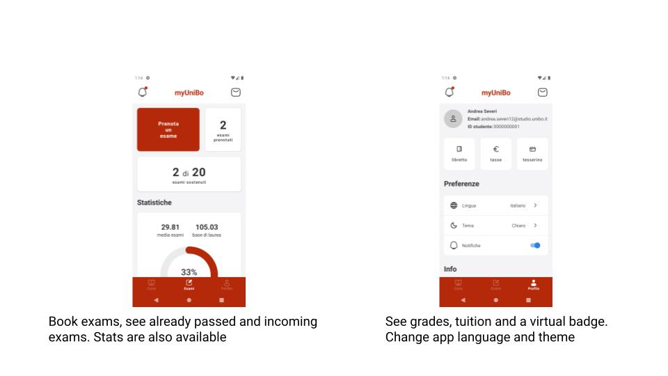
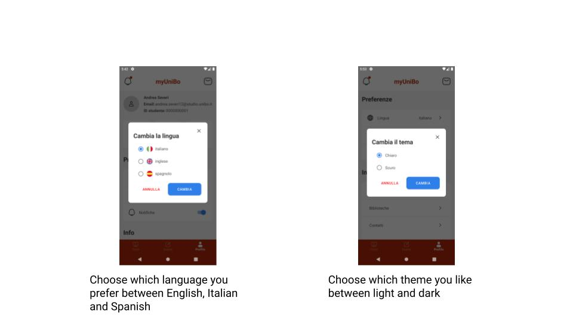

    

# myUniBo
[myUniBo](https://play.google.com/store/apps/details?id=com.myunibo) app revisited using [Jetpack Compose] by Android.
myUniBo is the main app for students enrolled to the Alma Mater Studiorum University of Bologna, Italy. It lets you book exams, see lessons of the day, grades and stats about your career

## New functionalities
- add "fake" grades to see how gpa and starting grade change
- add [Virtuale](https://virtuale.unibo.it/) courses (each course contains slides, past exams and professors announcements)
- add tuition screen, otherwise you would go to [Studenti Online](https://studenti.unibo.it/sol/welcome.htm) to see it
- add Dark Theme support
- add virtual badge with future possibility of combining it with NFC to unlock doors on campus

### What did I use?
- [Kotlin](https://kotlinlang.org/) as main language
- [Jetpack Compose] as modern toolkit for native UI
- [Material components for Jetpack Compose](https://developer.android.com/reference/kotlin/androidx/compose/material/package-summary#top-level-functions) to build UI faster
- [Room](https://developer.android.com/training/data-storage/room) as local DB
- [Datastore](https://developer.android.com/topic/libraries/architecture/datastore?gclid=CjwKCAjwkYGVBhArEiwA4sZLuMMCRUnWZzzy-AwDePYTUTn3gO6-rrT8jGo7D-H2vztegIJ-zEsb8hoCtI8QAvD_BwE&gclsrc=aw.ds) to cache user info, instead of SharedPreferences since it's deprecated
- [Dagger Hilt](https://developer.android.com/training/dependency-injection/hilt-android) for Dependency Injection
- [Kalendar](https://github.com/hi-manshu/Kalendar) to use Calendar Component for Homepage
- [Accompanist System Controller](https://google.github.io/accompanist/systemuicontroller/) to change status and navigation bar colors

<!-- Links -->
[Jetpack Compose]: https://developer.android.com/jetpack/compose
